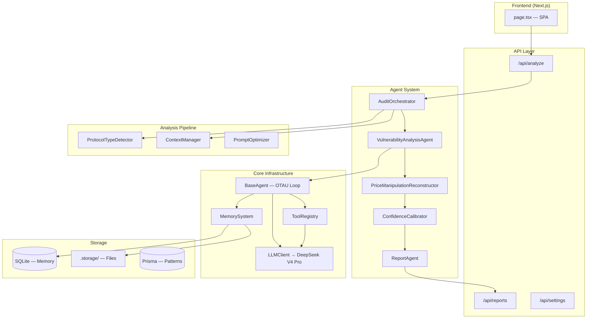

# DeFi Price Manipulation Analyzer — System Architecture

> 版本: v3.6.0 | 最后更新: 2026-06-11

---

## 1. System Overview



---

## 2. Audit Pipeline — 6 Stages

```
┌─────────────────────────────────────────────────────────────────────────┐
│                        AuditOrchestrator.run()                          │
│                                                                         │
│  ┌──────────┐  ┌──────────┐  ┌──────────┐  ┌──────────┐  ┌──────────┐  ┌──────────┐
│  │ Stage 1  │→│ Stage 2  │→│ Stage 3  │→│ Stage 4  │→│ Stage 5  │→│ Stage 6  │
│  │ Protocol │  │ Context  │  │ Vuln     │  │ Attack   │  │ Confidence│  │ Report   │
│  │ Detection│  │ Building │  │ Analysis │  │ Reconst. │  │ Calibration│ │ Generation│
│  └──────────┘  └──────────┘  └──────────┘  └──────────┘  └──────────┘  └──────────┘
│   ~5s           ~10s          ~600s          ~60s           ~5s           ~60s
│                                                                         │
│  Total timeout: 740s (per-stage budgets)                               │
└─────────────────────────────────────────────────────────────────────────┘
```

| Stage | Component | Timeout | Input | Output |
|-------|-----------|---------|-------|--------|
| 1 | `ProtocolTypeDetector` | 5s | source code | `ProtocolClassification` |
| 2 | `ContextManager` | 10s | classification | `AnalysisContext` |
| 3 | `VulnerabilityAnalysisAgent` | 600s | context | `VulnerabilityAnalysisResult` |
| 4 | `PriceManipulationReconstructor` | 60s | vulns + classification | `ReconstructionResult` |
| 5 | `ConfidenceCalibrator` | 5s | vulns + reconstruction | `CalibratedResult` |
| 6 | `ReportAgent` | 60s | calibrated result | `reportMarkdown` |

---

## 3. OTAU Loop Wiring

```
VulnerabilityAnalysisAgent.run()
  │
  ├─ iteration 1 ──────────────────────────────────────────────────────
  │   observe()  → ProtocolTypeDetector + ContextManager.build()
  │   think()    → "Classified as {type}, analyze with priority patterns"
  │   act()      → PromptOptimizer.optimizeSystemPrompt()
  │              → this.tools.execute('vulnerability_analyzer', {systemPrompt, userPrompt})
  │              → LLMClient.getJSON() via ToolRegistry
  │   update()   → memory.remember(iteration result as working memory)
  │
  ├─ iteration 2+ ─────────────────────────────────────────────────────
  │   observe()  → Review previous iteration result
  │   think()    → Check analysis gaps (missing patterns, oracle dep, etc.)
  │   act()      → Same as iteration 1 (optimized prompt + ToolRegistry)
  │   update()   → memory.remember() + convergence check
  │
  └─ shouldTerminate? ─────────────────────────────────────────────────
     • maxIterations reached → finalize
     • action.type === 'finalize' → finalize
     • convergence delta < 0.05 → finalize (T4)
```

### Tool Registration (T1)

```
VulnerabilityAnalysisAgent constructor
  │
  └─→ this.tools.register({
        name: 'vulnerability_analyzer',
        description: 'Analyzes smart contract code for price manipulation vulnerabilities',
        execute: (params) => this.llm.getJSON(systemPrompt, userPrompt),
        retryPolicy: { maxRetries: 2, backoffMultiplier: 2, initialDelayMs: 2000 },
        timeout: 90000
      })
```

---

## 4. Memory System — Three Layers

```
┌──────────────────────────────────────────────────────────────┐
│                      MemorySystem                            │
│                                                               │
│  ┌──────────────┐  ┌──────────────┐  ┌──────────────────┐   │
│  │   Working    │  │   Episodic   │  │    Semantic      │   │
│  │   Memory     │  │   Memory     │  │    Memory        │   │
│  ├──────────────┤  ├──────────────┤  ├──────────────────┤   │
│  │ In-memory Map│  │ SQLite       │  │ Vector Store     │   │
│  │ Max 100      │  │ Persistent   │  │ (in-memory)      │   │
│  │ LRU eviction │  │              │  │ cosine sim       │   │
│  │ Session-only │  │ Cross-session│  │ Cross-session    │   │
│  └──────────────┘  └──────────────┘  └──────────────────┘   │
│       ↓                  ↓                    ↓               │
│  clearWorking()    storage.save()     vectorStore.add()     │
│  (on run() end)    storage.load()     vectorStore.search()  │
└──────────────────────────────────────────────────────────────┘
```

### MemoryRecord Schema

```typescript
interface MemoryRecord {
  id: string;                    // mem_{type}_{timestamp}_{random}
  type: 'working' | 'episodic' | 'semantic';
  content: string;
  embedding?: number[];          // 64-dim hash embedding
  metadata: Record<string, unknown>;
  timestamp: number;
  accessCount: number;
  importance: number;            // 0.0 - 1.0
}
```

---

## 5. Protocol Detection → Vulnerability Mapping

```
Source Code
    │
    ▼
ProtocolTypeDetector.detect()
    │
    ├── codePatternScore × 0.7 + signatureScore × 0.3
    │
    ▼
ProtocolClassification
    │
    ├── type: 'dex' | 'amm' | 'lending' | 'perp' | ...
    ├── confidence: 0.0 - 1.0
    ├── priorityVulnerabilities: ['OD-01', 'OD-02', ...]
    ├── riskProfile: { flashloanExposure, oracleDependency, ... }
    │
    ▼
ContextManager.build()
    │
    ├── relevantPatterns (filtered by protocol type)
    ├── relevantCases (from history.json)
    ├── focusAreas (protocol-specific)
    └── contractCode
```

### Priority Vulnerability Patterns by Protocol

| Protocol | Priority Patterns |
|----------|------------------|
| DEX/AMM | OD-01~05, LR-01, LR-03, TO-01~03, CL-01, CL-03, CR-03 |
| Lending | OD-01~05, LR-01~02, TO-01, TO-03, CL-02, CR-01 |
| Perp | OD-01~05, LR-01~02, TO-01~02, CL-02, CR-01, CR-03 |
| Stablecoin | OD-01~05, LR-03, TO-01, AC-02~03, CR-01 |
| Yield Agg. | LR-01, LR-03, TO-01, CR-01~03 |
| Bridge | LR-03, CL-02, CR-01~03, AC-02 |

---

## 6. Confidence Calibration — 5 Dimensions

```
ConfidenceCalibrator.calibrate()
    │
    ├── Dimension 1: Source Availability (25%)
    │   └── full source = 1.0, context-only = 0.4
    │
    ├── Dimension 2: Pattern Match (25%)
    │   └── exact match = 1.0, partial = 0.5
    │
    ├── Dimension 3: Historical Cases (20%)
    │   └── matched cases = 1.0, no match = 0.2
    │
    ├── Dimension 4: Cross-validation (15%)
    │   └── consistent across iterations = 1.0
    │
    └── Dimension 5: Economic Feasibility (15%)
        └── high profit margin = 1.0, low = 0.3
```

---

## 7. File Structure with Task Annotations

```
src/lib/agents/
├── core/
│   ├── base-agent.ts              — [DONE] BaseAgent OTAU loop
│   ├── types.ts                   — [DONE] AgentConfig, AgentState
│   ├── llm-client.ts              — [DONE] LLMClient wrapper
│   ├── tools/
│   │   ├── registry.ts            — [DONE] ToolRegistry with retry/cache
│   │   ├── types.ts               — [DONE] ToolDefinition, ToolResult
│   │   └── llm-tool.ts           — [T1] LLM tool wrapper
│   └── memory/
│       ├── memory.ts              — [DONE] MemorySystem 3-layer
│       ├── storage-adapter.ts     — [DONE] File-based storage
│       ├── vector-store.ts        — [DONE] In-memory vector store
│       └── sqlite-store.ts       — [H1] SQLite backend
├── audit/
│   ├── protocols/
│   │   ├── protocol-type-detector.ts  — [DONE] 8 protocol types
│   │   └── types.ts                   — [DONE] ProtocolClassification
│   ├── context/
│   │   └── context-manager.ts     — [DONE] Analysis context builder
│   ├── vulnerability/
│   │   ├── vulnerability-agent.ts — [DONE] OTAU wired, PromptOptimizer integrated
│   │   └── prompt-optimizer.ts    — [DONE] Protocol-specific prompts
│   ├── reconstruction/
│   │   ├── price-manipulation.ts  — [DONE] Per-vuln overlay (PatternOverlay x21) + mergeTemplate + optimized category base
│   │   └── types.ts              — [DONE] PatternOverlay + TemplateInput
│   ├── calibration/
│   │   └── confidence-calibrator.ts — [DONE] 5-dim calibration
│   ├── cross-contract/
│   │   └── cross-contract-tracer.ts — [T8] Cross-contract taint analysis
│   └── orchestrator/
│       └── audit-orchestrator.ts  — [T3] Per-stage timeout needed
├── prompts/
│   ├── vulnerability.ts           — [DONE] System prompts
│   └── report.ts                  — [DONE] Report prompts
├── vulnerability-agent.ts         — [DONE] Legacy single-pass (deprecated)
└── report-agent.ts                — [DONE] Report generation

src/lib/
├── llm.ts                         — [DONE] OpenAI-compatible (DeepSeek V4 Pro)
├── cost/
│   ├── types.ts                     — [DONE] AttackCostEstimate interface
│   ├── chain-native-token.ts        — [DONE] 7-chain native token mapping
│   ├── cost-registry.ts             — [DONE] ToolRegistry with 3 cost tools
│   ├── tools/
│   │   ├── gas-price.tool.ts        — [DONE] Etherscan Gas Tracker Oracle
│   │   ├── native-price.tool.ts     — [DONE] CoinGecko keyless API
│   │   └── flash-loan-fee.tool.ts   — [DONE] Aave V3 0.05% + Balancer V2 0%
│   └── estimator.ts                 — [DONE] Deterministic cost estimation
├── iteration/
│   └── budget.ts                 — [T11] Adaptive iteration budget
├── symbolic/
│   ├── slither-runner.ts        — [T7] Slither runner + JSON parser
│   ├── detector-mapping.ts      — [T7] Slither detector → 21 pattern ID mapping
│   ├── ts-verifiers/            — [T7] 9 TS AST verifiers (OD-01~05, LR-01, CR-01, CR-04, TO-01)
│   │   ├── ast-utils.ts         — [T7] Shared AST utility functions
│   │   ├── index.ts             — [T7] Verifier registry
│   │   └── *.ts                 — [T7] Per-pattern verifiers
│   └── verifier-orchestrator.ts — [T7] Dual-layer verification entry point

src/app/api/analyze/
├── route.ts                       — [DONE] SSE stream + polling dual-mode
└── state.ts                       — [DONE] In-memory task state + EventEmitter + TTL

eval/                              — [T12] Evaluation harness
├── dataset/
├── run-agent.ts
├── run-baselines.ts
├── metrics.ts
├── pocs/run-forge.ts
└── report.ts
```

---

## 8. Key Architecture Decisions

| Decision | Rationale |
|----------|-----------|
| OpenAI-compatible API (DeepSeek) | Eliminates Z.ai SDK dependency; single LLM mode |
| ToolRegistry for LLM calls | Enables retry, cache, timeout per tool invocation |
| PromptOptimizer per-protocol | 8 protocol types get specialized analysis focus |
| Working memory LRU (max 100) | Prevents unbounded growth within session |
| Episodic memory in SQLite | Race-condition safe for concurrent audits |
| Per-stage timeouts | Debuggable: which stage is slow? |
| OD-01~05 + CR-01~05 | Complete 21-pattern coverage per vulnerabilities.json |
| T7: Slither + TS AST (not Mythril) | 3 days vs 6–12 days; covers 16/21 patterns; full TS debug stack |
| T12: v1 minimum viable eval | 1.5–2 days baseline; v2 adds Slither/PoC comparison |

---

## 9. Task Dependency Graph

```
H1 (SQLite) → T1 (OTAU) → T2 (PromptOptimizer) → T5 (Structured Output) → T7 (Slither + TS AST) → T12 (Eval) → T13 (Docs)
                                                      ↑
                                                      │
T3 (Timeouts) ────────────────────────────────────────┤ (parallel anytime)
T4 (Convergence) ──────────────────────────────────────┤
T6 (Prisma) → T8 (Cross-contract) → T11 (Adaptive)   │
T9 [DONE] (Per-vuln overlay) ──────────────────────────┤
T10 (Cost estimation) ────────────────────────────────┘
T14 (SSE state machine) ──────────────────────────────┘
```

**Critical path**: T1 → T2 → T5 → T7 → T12 → T13

**Must-do**: T1, T2, T3, T5, T6, T7, T12-v1, T13 (~12–15 person-days, 3 weeks)

**Stretch**: T8, T11 (8–13 person-days)
